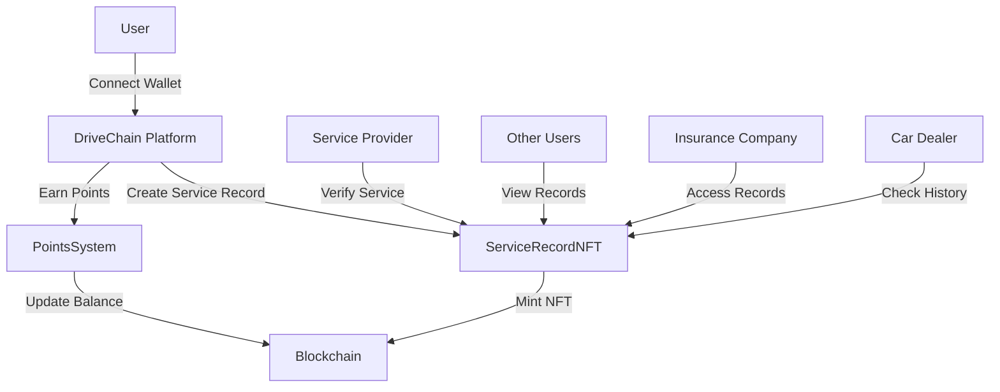

# DriveChain


## Vision

DriveChain is a blockchain-based platform that revolutionizes the automotive service industry by creating a transparent, secure, and efficient ecosystem for vehicle maintenance records and service points management. Our vision is to build trust and transparency in the automotive service industry through blockchain technology.

## Features

### Core Modules

1. **Service Record Management**
   - NFT-based service records
   - Immutable maintenance history
   - Service verification system
   - Digital service certificates
   - Service record sharing
   - Record version control

2. **Points System**
   - Service-based points accumulation
   - Points transfer and redemption
   - Service type multipliers
   - Points history tracking
   - Points expiration management
   - Points conversion rates

3. **Smart Contract Integration**
   - ServiceRecordNFT contract
   - PointsSystem contract
   - Event-driven architecture
   - Secure transactions
   - Gas optimization
   - Upgradeable contracts

4. **User Interface**
   - Wallet integration
   - Service record creation
   - Points management
   - Transaction history
   - Real-time notifications
   - Dark/Light mode
   - Responsive design

## Technical Architecture

### Frontend
- React with TypeScript
- Tailwind CSS for styling
- Ethers.js for blockchain interaction
- Context API for state management
- Service workers for offline support
- Web3Modal for wallet connection
- React Query for data fetching

### Backend
- Node.js with Express
- TypeScript for type safety
- RESTful API architecture
- JWT authentication
- MongoDB for data storage
- Redis for caching
- Socket.IO for real-time updates

### Blockchain
- Ethereum-based smart contracts
- Solidity for contract development
- Hardhat for development environment
- OpenZeppelin for security standards
- Chainlink for oracles
- IPFS for file storage

### Infrastructure
- Docker for containerization
- AWS for cloud hosting
- CI/CD pipeline
- Automated testing
- Monitoring and logging
- Backup and recovery

## Security Features

### Smart Contract Security
- Reentrancy protection
- Access control
- Pausable functionality
- Emergency stop
- Timelock for upgrades
- Signature verification

### Application Security
- Rate limiting
- Input validation
- SQL injection prevention
- XSS protection
- CSRF tokens
- Secure headers

### Data Security
- End-to-end encryption
- Secure key management
- Data backup
- GDPR compliance
- Data retention policies
- Audit logging

## Workflow



## API Documentation

### Service Record API

#### Create Service Record
```http
POST /api/service-records
Content-Type: application/json

{
  "serviceType": "string",
  "serviceDate": "date",
  "serviceProvider": "string",
  "vehicleInfo": {
    "vin": "string",
    "make": "string",
    "model": "string",
    "year": "number"
  },
  "serviceDetails": "string"
}
```

#### Get Service Record
```http
GET /api/service-records/{tokenId}
```

#### Verify Service Record
```http
POST /api/service-records/{tokenId}/verify
```

### Points System API

#### Get Points Balance
```http
GET /api/points/balance/{address}
```

#### Transfer Points
```http
POST /api/points/transfer
Content-Type: application/json

{
  "from": "address",
  "to": "address",
  "amount": "number"
}
```

#### Get Service Type Multipliers
```http
GET /api/points/multipliers
```

## Business Model

### Revenue Streams
1. **Transaction Fees**
   - Small percentage on points transfers
   - Service record verification fees
   - Premium service charges

2. **Premium Features**
   - Advanced analytics
   - Custom service types
   - API access
   - Priority support
   - Custom integrations

3. **Partnership Programs**
   - Service provider integration
   - Insurance company partnerships
   - Automotive manufacturer collaborations
   - Dealer network integration
   - Fleet management solutions

### Value Proposition
- Increased transparency in vehicle maintenance
- Reduced fraud in service records
- Enhanced customer trust
- Streamlined service verification
- Improved service provider reputation
- Lower insurance premiums
- Better resale value
- Efficient fleet management

## Project Status

### Completed
- [x] Smart contract development
- [x] Basic frontend structure
- [x] Backend API setup
- [x] Event management system
- [x] Notification system
- [x] Wallet integration
- [x] Basic UI components

### In Progress
- [ ] Frontend testing
- [ ] Performance optimization
- [ ] Security audit
- [ ] Documentation
- [ ] Mobile responsiveness
- [ ] API documentation
- [ ] Integration tests

### Planned
- [ ] Mobile application
- [ ] Service provider dashboard
- [ ] Analytics platform
- [ ] API marketplace
- [ ] Insurance integration
- [ ] Dealer network
- [ ] Fleet management

## Deployment Guide

### Prerequisites
- AWS account
- Docker installed
- Domain name
- SSL certificate

### Deployment Steps

1. **Infrastructure Setup**
```bash
# Create ECS cluster
aws ecs create-cluster --cluster-name drivechain

# Create RDS instance
aws rds create-db-instance \
    --db-instance-identifier drivechain-db \
    --db-instance-class db.t3.micro \
    --engine mongodb \
    --master-username admin \
    --master-user-password password \
    --allocated-storage 20
```

2. **Backend Deployment**
```bash
# Build Docker image
docker build -t drivechain-backend .

# Push to ECR
aws ecr create-repository --repository-name drivechain-backend
docker tag drivechain-backend:latest $AWS_ACCOUNT_ID.dkr.ecr.$REGION.amazonaws.com/drivechain-backend:latest
docker push $AWS_ACCOUNT_ID.dkr.ecr.$REGION.amazonaws.com/drivechain-backend:latest

# Deploy to ECS
aws ecs register-task-definition --cli-input-json file://backend-task-definition.json
aws ecs create-service --cluster drivechain --service-name backend --task-definition backend:1
```

3. **Frontend Deployment**
```bash
# Build production version
npm run build

# Deploy to S3
aws s3 sync build/ s3://drivechain-frontend
aws cloudfront create-distribution --origin-domain-name drivechain-frontend.s3.amazonaws.com
```

## Badges


## Directory Structure

```
src/
├── backend/
│   ├── src/
│   │   ├── config/
│   │   ├── controllers/
│   │   ├── models/
│   │   ├── routes/
│   │   └── services/
│   ├── tests/
│   └── contracts/
├── frontend/
│   ├── src/
│   │   ├── components/
│   │   ├── context/
│   │   ├── services/
│   │   └── utils/
│   └── public/
└── contracts/
    ├── ServiceRecordNFT.sol
    └── PointsSystem.sol
```

## Getting Started

### Prerequisites
- Node.js (v16+)
- npm or yarn
- Hardhat
- MongoDB
- MetaMask or other Web3 wallet
- Docker (optional)
- AWS CLI (for deployment)

### Installation

1. Clone the repository
```bash
git clone https://github.com/yourusername/drivechain.git
cd drivechain
```

2. Install dependencies
```bash
# Install backend dependencies
cd src/backend
npm install

# Install frontend dependencies
cd ../frontend
npm install
```

3. Set up environment variables
```bash
# Backend
cp .env.example .env

# Frontend
cp .env.example .env
```

4. Start the development servers
```bash
# Start backend
cd src/backend
npm run dev

# Start frontend
cd src/frontend
npm start
```

## Contributing

Please read [CONTRIBUTING.md](CONTRIBUTING.md) for details on our code of conduct and the process for submitting pull requests.

## License

This project is licensed under the MIT License - see the [LICENSE.md](LICENSE.md) file for details.

## Contact

- Website: [drivechain.io](https://drivechain.io)
- Twitter: [@DriveChain](https://twitter.com/DriveChain)
- Email: contact@drivechain.io
- Discord: [DriveChain Community](https://discord.gg/drivechain)
- GitHub: [DriveChain Organization](https://github.com/drivechain)
